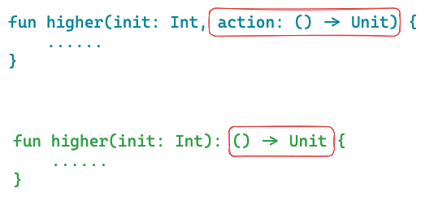

## 前言
首先需要明确一点就是Kotlin是一门多范式语言，Kotlin天生支持一些函数式编程特性
在Kotlin中，函数是一等公民，它不像Java一样，Kotlin中的函数可以声明在顶层，还可以写在函数内，并且还可以用作参数或者返回值

## 深析Lambda与高阶函数

什么是函数式编程？
函数式编程是一种编程范式，函数式编程通常会用函数和表达式来描述程序的行为。
现在很多语言都支持函数式编程，比如Java、Kotlin、C#等等。
不过多解释函数式编程的概念，我们可以看一下它带来什么优势：
- 代码简洁，可读性好
- 类似自然语言，易于理解
- 更多地表达了业务逻辑，易于维护
- 模块化工程
- 易于“并发编程”

这里引入一下 **“抽象”** 的概念，“抽象”是计算机中非常重要的一个概念，在《深入理解计算机系统》一书的开篇第一章就解释过，书中提及”为一组函数规定一个简单的应用程序接口（API）就是一个很好的编程习惯，程序员无需了解它内部的工作便可以使用这些代码“。

其实函数式编程亦是如此，我们知道**面向对象编程是对数据进行抽象**，而**函数式编程是对行为进行抽象**，两者理应相辅相成

那么Lambda和高阶函数又是个什么东西呢？

其实Lambda本质上就是**匿名函数**，在不同的语言中细节上会略有不同，在Kotlin中，Lambda表达式形如`parameter -> expression`。有了Lambda，我们就可以将函数用作函数的参数传递、返回值等。Lambda表达式给我们带来的比较直观的感受就是代码变得==简洁==了。

而高阶函数则是可以**接收函数作为参数**或者**将函数作为返回值**的函数。比如下图所示，higher函数中接收函数类型为参数以及返回值为函数类型（Kotlin示例），这个higher函数就是**高阶函数**


## 与Java中Lambda的不同

没接触过Java的小伙伴这块可以跳过，不影响对Kotlin中Lambda的学习和理解。

我们知道在Java中其实使用Lambda还是有一些约束的，Java的主流思想依旧是面向对象，在Java8之后，新引入了部分特性来支持函数式编程。自此，Java的世界里也出现了函数是一等公民的说法。然而，Java中的Lambda表达式并不是随意使用，也并不是在方法中直接传递方法，而是通过一个叫做**函数式接口（Functional interface）** 或者 **SAM（Single Abstract Method）** 的东西来实现Lambda。所以参数和返回值本质上是接口类型的实例而不是函数！只是可以通过Lambda表达式来*实现单一抽象方法的接口*

Kotlin中的函数是严格意义上的接收函数作为参数或者返回值为函数类型。但是还会有一个问题，我们知道，在Kotlin中，一切皆对象。也就是说，函数也是对象，它在Kotlin中是一种数据类型。没错，它是一种叫做`Function`的数据类型（也是一个接口），只不过有时候会根据参数不同在后面追加相应的数字。

所以，又绕回来了，如果说基于Kotlin中一切皆对象的说法，Kotlin函数的参数以及返回值中其实本质上也是一个接口实例，那不就跟Java是一样了吗？

确实，在本质上Java和Kotlin中的对Lambda实现本质上是一样的，Kotlin在JVM层上设计了`Function`类型来兼容Java的Lambda表达式，都是传递的**接口类型**。然而，在Kotlin中我们随处都可以定义我们的Lambda表达式，直觉上就是直接定义函数。而Java中我们还要提前定义对应的**函数式接口**，应用于特殊的场景，比如Runnable这个接口在Java8之后就添加了@FunctionalInterface注解注释。相比之下，Java的Lambda表达式应用于特殊场景，为其提供**更简洁、可读性更好**的语法，而Kotlin的Lambda表达式**应用场景更加频繁**，且语法更加**灵活简洁**，当然，Lambda也是Kotlin中的一个**语法糖**。

以及两种语言在Lambda表达式上的语法、实现等方面也有很大的区别，这里不接着往下解说Java的Lambda表达式了，感兴趣的小伙伴可以去读一下Oracle关于 Java Lambda的一些学习教程：[https://docs.oracle.com/javase/tutorial/java/javaOO/lambdaexpressions.html](https://docs.oracle.com/javase/tutorial/java/javaOO/lambdaexpressions.html)

## 步入正题

前面只是对Lambda的一些理解，接下来我们通过解析Kotlin的Lambdas以及一些案例来熟练掌握Kotlin中的Lambda

### 第一个Lambda

```Kotlin
fun main() {  
	val firstLambda: (String) -> Unit = { str -> println("Hello $str") }  
	firstLambda("Lambda")  
}
```

在第二行我们定义了第一个Lambda表达式。等号左边是变量`firstLambda`的**类型**，它是一个函数类型 `(String) -> Unit`，接收一个String类型的参数无返回值；等号右边是变量`firstLambda`的**字面值**，我们需要用一对花括号`{}`括起来。

可以看到等号左右形式很相似，等号左边因为是类型，因此只需定义*参数类型以及返回值类型*；而等号右边是字面值（可以理解为实例），因此需要写上*接收的参数*（不需要声明类型了，因为等号左边已经声明过类型，编译器会自动推断）以及*具体的函数体内容*。 这里面还有一个不同，就是等号左边声明的类型`->`左边的参数类型必须加括号`()`，而等号右边不需要。

当然您也可以省略`firstLambda`的类型，让编译器去自动推断，这时候您就需要在字面值中显式指定参数类型了

```Kotlin
val firstLambda = { str: String -> println("Hello $str") }  
```

因为`firstLambda`是一个函数类型的实例引用，其实也就是Kotlin中的正常函数了，我们就可以直接调用。

然后我们还可以去看一下这个`firstLambda`它到底是什么类型的一个实例，我们直接输出它

```Kotlin
println(firstLambda) // 输出为 Function1<java.lang.String, kotlin.Unit>
```

我们看到了它的输出，其实就是一个`Function`类型的实例，那为什么后面会跟一个数字1呢？其实也就是我们前面所说的根据参数追加数字，这里只有一个参数，因此是`Function1`，我们可以多写几个来尝试

```Kotlin
val secondLambda = { str: String, num: Int -> println("$str $num") }  
println(secondLambda) // 输出 Function2<java.lang.String, java.lang.Integer, kotlin.Unit>  
val thirdLambda: (Int, Int) -> Int = { num1, num2 -> num1 * num2 }  
println(thirdLambda) // 输出 Function2<java.lang.Integer, java.lang.Integer, java.lang.Integer>
```

我们可以看到，因为我们这两个Lambda表达式都是接收两个参数，因此是`Function2`类型，而泛型中最后一个是**返回值类型**，前面的是**参数列表类型**

要注意一点字面量Lambda表达式如果有返回值，函数体不用写`return`关键字，若有多条语句需要执行，则需要将返回值放到最后，比如我们可以将`thirdLambda`的示例改写如下

```Kotlin
val thirdLambda: (Int, Int) -> Int = { num1, num2 ->  
	println("Hello")  
	println("World")  
	num1 * num2 // 这个是返回值
}  
println(thirdLambda) // 输出 Function2<java.lang.Integer, java.lang.Integer, java.lang.Integer>
```

### 实例化函数类型

Kotlin官网给出了我们几种实例化函数类型的方式，其实，我们上面写的第一个Lambda只是使用第一种方式，也就是Lambda表达式的形式，下面介绍其他的方式。

我们说过，Kotlin中，Lambda本质上就是匿名函数，所以我们可以用匿名函数的方式去实例化

```Kotlin
fun main() {  
	val firstLambda: (String) -> Unit = fun(str: String) = println("Hello $str") 
	firstLambda("Lambda")  
}
```

是不是感觉蛮有意思的，我们等号右边并没有用Lambda表达式，用`fun`关键字定义了函数，并且没有名字，所以它叫匿名函数。

根据上面代码函数对Lambda表达式的等价替换我们就得出了以下结论：
- Lambda表达式本质上就是**匿名函数**
- Kotlin中函数也是**对象**

Kotlin官网中也提供了一个类实现函数接口进而实例化函数类型的示例，这里我们简单试一下

```Kotlin
fun main() {
	val strToUppercase: (String) -> String = StrToUppercase()  
	val result = strToUppercase("lambda")  
	println(result) // LAMBDA
}

class StrToUppercase: (String) -> String {  
	override operator fun invoke(str: String) = str.uppercase()  
}
```

上面的例子也就是`StrToUppercase`实现了`Function1<java.lang.String, java.lang.String>`接口，重写`invoke`函数即可，比较简单。

此外，Kotlin官网还有一个有接收器（receiver）的示例，我们来简化一下

```Kotlin
fun main() {
	val repeatFun: String.(Int) -> String = { times -> this.repeat(times) }
	printRepeatStr("Hello", 3, repeatFun)
}

fun printRepeatStr(str: String, count: Int, action: (String, Int) -> String) {  
	println(action(str, count))  
}
```

由上面的例子我们可以看到，`printRepeatStr`函数的最后一个参数需要传入一个`(String, Int) -> String`类型的参数，而我们传入的参数是`repeatFun`，它是`String.(Int) -> String`类型的，因此我们发现了这两者是等价的，`String.(Int) -> String`就等价于`(String, Int) -> String`，它本身实例就当作第一个`String`类型的参数。

其实上面的例子中，我们还给所有`String`类型的实例添加了`repeatFun`这个成员函数，如下

```Kotlin
fun main() {
	val repeatFun: String.(Int) -> String = { times -> this.repeat(times) }
	val str: String = "Hello"  
	val res = str.repeatFun(3)  
	println(res) // HelloHelloHello
}
```

我们其实发现它跟我们Kotlin中的函数扩展很像，所以以上代码等价于

```Kotlin
fun main() {
	val str: String = "Hello"  
	val res = str.repeatFun(3)  
	println(res) // HelloHelloHello
}

fun String.repeatFun(count: Int): String = this.repeat(count)
```

> 因为Kotlin中一切皆对象，所以我们可以自定义类型实现函数接口，最后实例化我们的自定义类型


### Lambda表达式的几个语法糖

下面介绍一下Kotlin中Lambda表达式的几个语法糖

- 如果Lambda表达式中只有一个参数，直接不写参数，直接用 `it` 来代替（it: implicit name of a single parameter）
- 函数中最后一个参数是函数类型实例，那Lambda表达式可以写在括号`()`外面（Passing trailing lambdas）

如下，我们用Kotlin中Array类的扩展函数`forEach`来举例子

```Kotlin
val arr: Array<Int> = arrayOf(1, 2, 3, 4)  
arr.forEach { println(it) }
```

我们看一下`forEach`这个扩展函数的源码


首先，`forEach`函数的参数只有一个参数，因此我们可以用`it`来代替那个参数，将 `arr.forEach { element -> println(element) }` 简写为 `arr.forEach { println(it) }` 的形式。然后`forEach`函数最后一个参数是函数类型，因此我们可以写在`()`外面，将 `arr.forEach({ println(it) })` 简写为 `arr.forEach { println(it) }`，当然这里只有一个参数，`()`可以省略了，我们可以自定义一个函数试试

```Kotlin
fun main() {
	val arr: Array<Int> = arrayOf(1, 2, 3, 4)  
	arr.forEachByCount(3) { println(it) }
}

fun<T> Array<T>.forEachByCount(count: Int, action: (T) -> Unit) {  
	var i = 0  
	for (element in this) {  
		action(element)  
		i++  
		if (i == count) break  
	}  
}
```

可以看到我们自定义的Array的扩展函数`forEachByCount`接收两个参数，`()`就不能省略了。最后一个参数是函数类型，可以写在`()`外，并且Lambda表达式中参数只有一个，可用`it`代替

最后补充一个小技巧，如果Lambda表达式中参数不用，可以用一个下划线`_`来代替
```Kotlin
map.forEach { (_, value) -> println("$value!") }
```

> 上述的两个简便写法都是Kotlin中Lambda表达式的语法糖，它是我们的代码在不影响可读性的前提下更加简洁优雅

### 闭包（Closures）

闭包简单的理解其实就是**一个函数内部访问了外部环境的变量**。Kotlin官网中给出了一个示例

```Kotlin
var sum = 0 
ints.filter { it > 0 }.forEach { 
	sum += it 
} 
print(sum)
```

当然，这里只给出了代码的一部分，总之我们可以看到，`forEach`函数中访问了外部变量`sum`，这就是**闭包**。其实**Lambda**就是Kotlin最常见的闭包形式。（这里多说一点，Java中的函数不能修改外部变量，而Kotlin却可以）

> Kotlin支持闭包，支持访问函数外部环境的变量

### 柯里化（Currying）、函数的链式调用

前面对高阶函数中我们提高了，它可以是参数接收函数或者返回值是函数，前面我们只讨论了参数是函数的情况，接下来我们看一下返回值是函数的情况。

柯里化其实是一种关于**函数的高阶技术**，维基百科中这样定义它：“是把接受多个[参数](https://zh.wikipedia.org/wiki/%E5%8F%83%E6%95%B8_(%E7%A8%8B%E5%BC%8F%E8%A8%AD%E8%A8%88) "参数 (程式设计)")的[函数](https://zh.wikipedia.org/wiki/%E5%87%BD%E6%95%B0 "函数")变换成接受一个单一参数（最初函数的第一个参数）的函数，并且返回接受余下的参数而且返回结果的新函数的技术”。

根据以上的定义我们懂了柯里化其实是将单个接收多个参数的函数转换成多个接收单个参数。我们看一下维基百科中给出的一个JavaScript的示例

```javascript
var foo = function(a) {
  return function(b) {
    return a * a + b * b;
  }
}
```

我们可以看到第一层函数返回值又是一个函数，调用的时候是`foo(3)(4)`，这不就是链式调用吗

Kotlin中的Lambda表达式也支持这种函数柯里化的写法，我们将上述代码转换为Kotlin代码

```Kotlin
fun squareSum(x: Int) = { y: Int -> x * x + y * y }
```

我们也可以通过`foo(3)(4)`进行一个链式调用

> 柯里化就是将单个接收多参数的函数转换为多个接收单参数的函数，通过函数的柯里化我们可以实现函数的链式调用

### 内联函数（Inline function）

这里只简单介绍一下内联函数。我们知道在Kotlin中函数也是对象，而我们在参数中传递函数或者返回函数必定会对函数类型进行实例化，这就会产生一定的运行时**内存开销**。在一些特殊场景下我们不希望它占用我们这些内存资源。

而内联函数就是要解决这个问题，用关键字`inline`修饰的函数就是内联函数。内联函数的本质其实是 **将调用的函数替换成相应函数体中执行的内容**，这些事情都是编译器做的。

那Java肯定也有这种性能开销的问题，Java是靠`invokedynamic`来完成的，这个了解即可。

我们通过上面Array的扩展函数的源码就可以理解了

![[23.jpg]]

因为这里要做遍历，若要每次实例化一个函数类型的对象就会产生一定开销，因此源码中用了`inline`关键字修饰。

这里需要注意几点
- 如果函数中并没有函数类型参数就不要写`inline`，IDE也会给出提示
- Inline function的本质还是编译器替换函数为具体执行的代码来减小开销，如果某个函数参数不希望编译器这么做，可以在参数前加一个`noinline`关键字修饰

至于反编译验证这里就不浪费时间了，感兴趣可以自己去尝试。

> 我们只需要了解内联函数对Lambda的作用即可，只是用来减小Lambda表达式的性能开销

### 函数引用

Kotlin中函数引用采用与Java类似的形式，使用`::`来实现

Kotlin中的函数引用分为下面几种
- 顶层声明
- 本地变量、函数
- 成员属性、函数
- 扩展函数、扩展属性
- 构造函数

这边我们简单的举几个例子吧

首先看一下成员函数

```Kotlin
class Person(val name: String, val age: Int) {  
	fun getMessage() = "$name $age"  
}

fun main() {
	val getMessage: (Person) -> String = Person::getMessage  
	val message = getMessage(Person("Jack", 20))
	println(message) // Jack 20
}
```

我们可以看到Person类中有一成员函数`getMessage`，而通过`Person::getMessage`得到的是一个`(Person) -> String`类型的示例，也就是一个函数类型的示例，我们通过这个函数实例去调用，参数是一个Person实例，返回值是String类型，也就是函数`getMessage()`的返回值。

联系一下前面，我们写过`val repeatFun: String.(Int) -> String = { times -> this.repeat(times) }`这段代码，我们说它就等价于一个String类的函数扩展。因为它是有一个接收器（receiver），即将*本身实例作为第一个参数传递进去*。`Person::getMessage`没有接收器，它并不是函数扩展，需要传递一个Person的实例.

那我们Kotlin中的函数引用也有扩展函数的，因此我们前面的那个例子也可以写成这样

```Kotlin
fun main() {
	val repeatFun: String.(Int) -> String = String::repeatFun
}

fun String.repeatFun(count: Int): String = this.repeat(count)
```

将`val repeatFun: String.(Int) -> String = { times -> this.repeat(times) }`替换为函数引用的形式`val repeatFun: String.(Int) -> String = String::repeatFun`

然后我们Person类中有个主构造函数，因此我们还可以使用构造函数引用`::Person`来获取一个Person实例，如下

```Kotlin
val person = ::Person  
val p = person("Jack", 20)
```

以上代码等价于

```Kotlin
val p = Person("Jack", 20)
```

最后我们再看一下顶层函数引用的例子

```Kotlin
fun main() {
	val s = ::sum  
	val res = s(1, 2)  
	println(res) // 3
}

fun sum(x: Int, y: Int) = x + y
```

> 需要注意的一点，我们看到函数引用的类型好像是函数类型`Function`，其实不是。它是Kotlin中一种叫做`KFunction`的类型，后面也会根据参数个数不同追加相应的数字，因此它是函数引用类型。但是由于在Kotlin中我们不能直接定义Function类型，而是只能用Lambda表达式的形式，这样就恰巧`Function`类型可以与`KFunction`类型配合使用


## 简单总结

- Kotlin中天然支持函数式编程的一部分特性，函数是一等公民。
- **面向对象编程是对数据进行抽象，函数式编程是对行为进行抽象**
- Lambda表达式是Kotlin对函数式编程最常见的支持形式
- 高阶函数是指参数或者返回值为函数的一种函数
- Kotlin相比Java，lambda表达式的使用更加频繁，语法更加**灵活简洁**
- Kotlin中Lambda表达式本质上就是**匿名函数**，是**实例化**函数类型的一种方式
- Kotlin中的Lambda表达式更加灵活，有许多语法糖，比如Passing trailing lambdas、it: implicit name of a single parameter
- Kotlin中的Lambda支持**闭包**以及**柯里化、链式调用**
- Kotlin中可以通过**内联函数（Inline function）** 来减小Lambda带来的性能开销
- Kotlin中的**函数引用**可以与Lambda表达式配合使用


## 参考

[Kotlin官放文档-Lambdas](https://kotlinlang.org/docs/lambdas.html)

[Java 8 - 函数编程(lambda表达式)](https://pdai.tech/md/java/java8/java8-stream.html)

水滴技术团队-《Kotlin核心编程》
